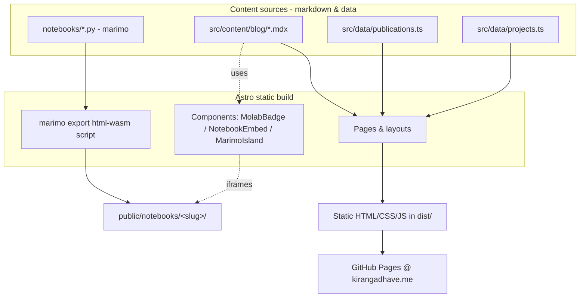

# Personal Website Overhaul — Design

> **Read first, applies throughout:**
> - The user implements the tasks. Keep task output brief (the step, not a full walkthrough).
> - Do not implement a task unless explicitly asked. If asked to implement one task, implement that one task, then default back to brief-tasks-only for the next.
> - Every push and every PR update requires manual approval.
> - Code comments must be understandable to a future reader with no history of the project.
> - No AI-slop comments.
> - Never auto-post comments or replies on GitHub.
> - Update the plan after every completed task or step: check off the box and (if status changed) bump `updated at` and `status` in the frontmatter. Do this in the same turn as the work, before moving on.

## Goal

Replace the current single-page Next.js site with a fast, static, markdown-driven personal site whose **interactive blog is the centerpiece**, alongside a professional/OSS identity and the research background. Updating content should mean editing markdown/data files. Blog posts can embed live marimo notebooks.

**Definition of done:** A statically-built Astro site deployed to GitHub Pages at `kirangadhave.me`, with Home, Blog (incl. at least one post embedding a working inline marimo island), Projects, Publications, About, and a rendered Résumé page — and the old dashboard-tutorial boilerplate fully removed.

## Context

The existing repo is Next.js 14 + MDX + Tailwind, but in practice renders **one page** (about/bio with photo, socials, publications); navbar/footer are disabled via `{false && ...}`, and stub pages exist for skills/projects/experience/education/resume/cv. It carries leftover Next.js dashboard-tutorial boilerplate (postgres, bcrypt, `scripts/seed.js`, `public/customers/*`, `app/lib/{data,definitions,placeholder-data}`). Host is GitHub Pages (static only); custom domain `kirangadhave.me` is already configured.

Author identity: OSS dev-tools engineer at marimo (reactive Python notebooks); prior PhD in visualization (University of Utah, VDL). Career notes emphasize that public writing/notebooks compound — hence the blog-forward direction.

## Decisions

| Decision | Choice | Rationale |
| --- | --- | --- |
| Framework | **Astro** | Markdown-first content collections, zero-JS-by-default static output, per-component islands for selective interactivity, first-class GitHub Pages deploy. |
| Hosting | **GitHub Pages**, static export | Already set up; free; matches static-first goal. |
| Domain | `kirangadhave.me` via `public/CNAME` | Already configured. |
| Look & feel | **Style B** — minimal/technical | Inter + mono, whitespace, single teal accent, system-aware light/dark toggle. Validated via visual mockups. |
| Styling | Tailwind + `@tailwindcss/typography` | Carried from current stack, retuned to new tokens. |
| Publications source | Static data file | Seeded from Google Scholar + VDL; appended by hand per paper. |
| GitHub stars | **Hardcoded for v1** | Avoids build-time dependency on a rate-limited API; upgradeable later. |
| Résumé | **Rendered HTML page** at `/resume` | Scaffolded with placeholder structure; real content added later. |
| marimo embedding | **Three mechanisms**, islands primary | Inline islands for "marimo book" prose; full-notebook WASM iframe; molab badge/iframe. |

## Architecture

### Deployment & custom domain (DNS)

Site is built statically and published to GitHub Pages via the `withastro/action` workflow on push to `main`. `astro.config` sets `site: 'https://kirangadhave.me'`; `public/CNAME` (contents: `kirangadhave.me`) is copied into `dist/` so the custom domain survives each deploy. In repo **Settings → Pages**, set the custom domain to `kirangadhave.me` and enable **Enforce HTTPS** once the certificate provisions.

DNS is managed at GoDaddy (registrar). Configure the **apex** with `A`/`AAAA` records (GoDaddy cannot `CNAME` the apex) and the **`www`** subdomain with a `CNAME` to the default Pages domain. With both in place, GitHub Pages auto-creates redirects between the apex and `www` (whichever is set as the custom domain is canonical; the other redirects to it).

| Type | Name | Value | TTL |
| --- | --- | --- | --- |
| A | `@` | `185.199.108.153` | 600 |
| A | `@` | `185.199.109.153` | 600 |
| A | `@` | `185.199.110.153` | 600 |
| A | `@` | `185.199.111.153` | 600 |
| AAAA | `@` | `2606:50c0:8000::153` | 600 |
| AAAA | `@` | `2606:50c0:8001::153` | 600 |
| AAAA | `@` | `2606:50c0:8002::153` | 600 |
| AAAA | `@` | `2606:50c0:8003::153` | 600 |
| CNAME | `www` | `kirangadhave.github.io` | 600 |

- The `www` `CNAME` must point at the default Pages domain (`kirangadhave.github.io`) **without** the repo name.
- Delete GoDaddy's default parked `A @` record and any default `www` record so they don't conflict.
- `AAAA` (IPv6) rows are optional; the four `A` records are the functional minimum.
- Verify after propagation: `dig kirangadhave.me +short` returns the four GitHub IPs.

### Routes
- `/` — Home: short intro, photo, what you do, links into the site. Static, snappy.
- `/blog` — reverse-chron index; `interactive` tag on marimo posts; date + reading time in mono.
- `/blog/[slug]` — individual post (MDX), prose with inline interactive components.
- `/projects` — card grid (repo, blurb, language, links).
- `/publications` — grouped by year; author's name bolded; venue in mono; per-paper links (project / PDF / DOI / code).
- `/about` — longer bio, background, socials/contact (migrated from current `about.mdx`).
- `/resume` — rendered HTML résumé (placeholder content for now).
- `/rss.xml` — blog RSS feed.

### Content model
- **Blog** (`src/content/blog/`, Astro content collection): MDX files with Zod-validated frontmatter:
  `title: string`, `date: Date`, `description: string`, `tags: string[]`, `interactive: boolean = false`, `molab: string (url, optional)`, `draft: boolean = false`. Draft posts excluded from production build and RSS.
- **Publications** (`src/data/publications.ts`): typed array. Seed set:
  1. Loops — Eckelt, **Gadhave**, Lex, Streit — IEEE VIS / TVCG, 2024
  2. Persist — **Gadhave**, Cutler, Lex — EuroVis / CGF, 2024
  3. Reusing Interactive Analysis Workflows — **Gadhave**, Cutler, Lex — EuroVis / CGF, 2022
  4. Predicting Intent Behind Selections in Scatterplot Visualizations — **Gadhave**, Görtler, Cutler, Nobre, Deussen, Meyer, Phillips, Lex — InfoVis, 2021
  5. Trrack — Cutler, **Gadhave**, Lex — IEEE VIS (short), 2020
  6. reVISit — Ding, Wilburn, … **Gadhave**, … Lex — IEEE VIS, 2023
  7. UpSet 2 — **Gadhave**, Strobelt, Gehlenborg, Lex — InfoVis poster, 2019
  8. Toward Reproducible and Reusable Visual Analysis — **Gadhave** — PhD dissertation, University of Utah, 2024

  Each entry carries optional links: `projectPage`, `pdf`, `doi`, `code`. Author details/links to be verified against VDL during implementation.
- **Projects** (`src/data/projects.ts`): typed array — marimo, Trrack, Persist, reVISit, and others. Fields: `name`, `blurb`, `language`, `repo`, `demo?`, `stars?` (hardcoded v1).

### marimo integration
Author-facing API is a small set of components used inside MDX:

- **`<MolabBadge url="..." />`** — renders the "Open in molab" badge linking to a hosted molab notebook. Simplest; reuse markup conventions from the `add-molab-badge` skill. Works day one.
- **`<NotebookEmbed slug="..." title="..." />`** — full-notebook WASM embed. Source notebooks live as marimo `.py` files in `notebooks/`. A build script runs `marimo export html-wasm` to produce a self-contained app under `public/notebooks/<slug>/`; the component renders a responsive `<iframe>` to it.
- **`<MarimoIsland ... />` (primary)** — inline reactive cells giving the "marimo book" reading experience. Uses the marimo **islands runtime** (CDN module script + stylesheet) plus generated island markup. Island markup is produced from a marimo `.py` source via marimo's island generator as a build step.

**Risk / prototype-first:** the islands path has the most unknowns (generator workflow, runtime versioning/CDN pinning, hydration inside Astro, CSS isolation). The implementation plan must **prove one real island in one real post end-to-end before building out the rest of the site**, so this is de-risked early. The molab badge and full-notebook iframe are low-risk fallbacks if islands prove impractical for v1.

### Styling system
- **Type:** Inter (UI/body), a monospace (code, labels, dates, venues).
- **Color:** light default; single teal accent (`#0d9488`-ish); neutral grays.
- **Dark mode:** system-aware default with manual toggle; preserve the existing localStorage key approach, fixed up (current `useDarkMode` has a hydration bug where it reads localStorage before mount).
- **Prose:** `@tailwindcss/typography`, tuned to the token set, for blog/about/resume body copy.

### Decommissioning
Delete: postgres/bcrypt/zod-auth-related deps, `@vercel/postgres`, `scripts/seed.js`, `public/customers/*`, `public/hero-*.png`, `app/lib/{data.ts,definitions.ts,placeholder-data.js}`, stub pages (`skills`, `experience`, `education`, `cv`), Next.js config and the entire `app/` tree once Astro equivalents exist. Migrate genuinely reused content (bio prose, socials, publications) into the new model first.

## Out of scope (v1)
- Live GitHub star fetching (hardcoded).
- Comments, analytics, newsletter signup.
- A "Now" page, talks/videos, uses/setup pages (can be added later as more markdown).
- Authoring real résumé content (placeholder scaffold only).
- Real blog post content beyond the one prototype/demo post needed to validate marimo embedding.

## Verification (how the user confirms it works)
1. `pnpm dev` (or `npm run dev`) serves the site locally; all seven routes render without console errors.
2. `pnpm build` produces a static `dist/` with no server dependencies; `pnpm preview` serves it identically.
3. The demo blog post shows a **working inline marimo island** — interacting with it (e.g. moving a slider) updates output in the browser with no backend.
4. A post with `<MolabBadge>` renders the badge and the link opens the molab notebook.
5. Publications page lists all 8 seed papers grouped by year with the author's name bolded and working links.
6. Light/dark toggle works and persists across reload without a flash of wrong theme.
7. Lighthouse: home page is fully static (minimal/zero JS) and scores well on performance.
8. On push to `main`, the GitHub Pages action builds and deploys; `https://kirangadhave.me` serves the new site with the custom domain intact.
